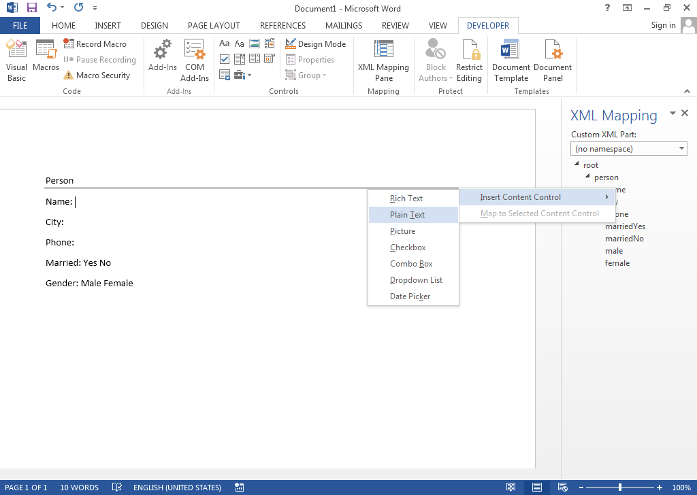

# A Java-based application used to fill word (docx) files.

## Introduction

Companies are every time demanding more automation tools for document generation, these tools are used to speed up contracts generation and client product/formulary documents. To support this necessity, tools like Word have been widely used to create these documents integrated with different technologies to fill data of template files. In this context, the Java programming language combined with the library DOCX4J allow, by programming, generate word documents files filled with XML data. However, besides the extensive documentation of the library and community, this article proposes to offer a very simple guide (step-by-step) to generate word document files using the Java library DOCX4J. This necessity is due to the lack of a very simple and informal document available on the internet.

## Guide to generate word files with Java

The WORD document generation is based on XML source files. In this example, the XML used in the word document template is presented below:

```{xml}
<?xml version="1.0" encoding="UTF-8" standalone="yes"?>
<root>
    <person>
        <name></name>
        <city></city>
        <phone></phone>
        <marriedYes></marriedYes>
        <marriedNo></marriedNo>
        <male></male>
        <female></female>
    </person>
</root>
```

With the XML structure defined, open the Word (Word 2013 in this tutorial) and enable the developer mode following the steps below:
* Select File tab > Options > Customize Ribbon
* In the right side of the Word Options dialog box, select Main Tabs and turn on Developer.
* Click OK.

With the Developer Tab activated, create a simple document template (Figure 1).


After that, go to the Developer Tab and select the option to show the "XML Mapping Pane", then in the "Custom XML Part" combo select "Add a new part" (Figure 2).


Then, use the text cursor to install a new control and map this positions using the XML Structure with the desired control type. You can configure text inputs like in Figure 3.



Another example of control available, is the checkbox ilustrated at Figure 4.

